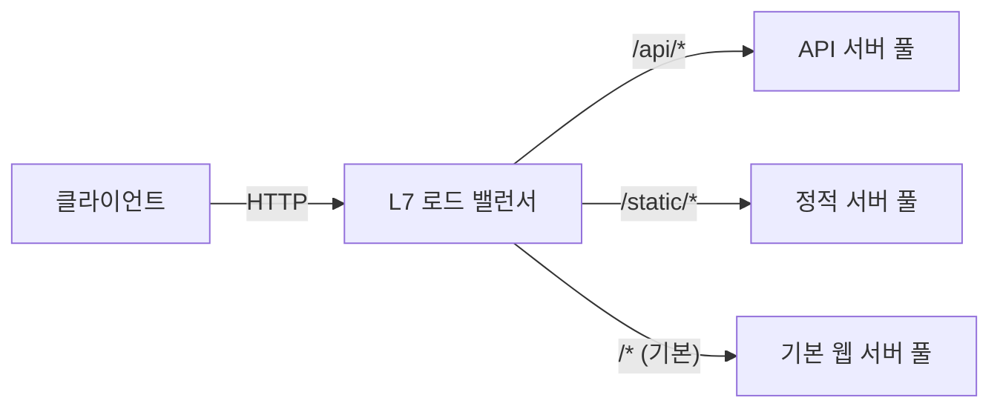

# URL 경로 기반으로 트래픽을 분산하는 L7 로드 밸런서 구성하기

로드 밸런서는 여러 인스턴스에 트래픽을 분산해 처리량을 늘리고, 상태 검사를 통해 장애가 발생한 인스턴스를 자동으로 서비스에서 제외시켜 가용성을 높이는 서비스입니다. NHN Cloud의 Load Balancer는 트래픽을 분산하는 방식에 따라 L4 라우팅과 L7 라우팅 두 가지 모드를 제공합니다.

| 구분 | L4 로드 밸런서 | L7 로드 밸런서 |
|---|---|---|
| 분산 기준 | IP 주소, 포트 번호 | URL 경로, 호스트명, 헤더, 쿠키 등 |
| 요청 내용 확인 | 확인하지 않음 | HTTP 요청을 분석함 |
| 적합한 상황 | 동일한 역할의 서버에 부하를 고르게 분산 | 요청 내용에 따라 서로 다른 서버 그룹으로 분기 |
| 예시 | 웹 서버 3대에 트래픽을 균등 분산 | `/api/*`는 API 서버로, `/static/*`는 파일 서버로 분기 |

**L4 로드 밸런서**는 네트워크 계층(Layer 4)에서 동작하며, IP 주소와 포트 번호만 보고 트래픽을 분산합니다. '80번 포트로 들어온 요청을 서버 A, B, C에 골고루 나눈다'처럼 단순한 분산에 적합하지만, 요청의 내용(URL, 헤더 등)은 확인하지 않습니다. **L7 로드 밸런서**는 애플리케이션 계층(Layer 7)에서 동작하며, HTTP 요청의 헤더를 분석해 URL 경로, 호스트명, 쿠키 등 조건에 따라 서로 다른 서버 그룹으로 트래픽을 분기하거나 리다이렉트를 유도할 수 있습니다.

이 가이드에서는 L7 로드 밸런서가 지원하는 다양한 조건 중 **URL 경로 기반 라우팅**을 사용해 트래픽을 서로 다른 서버 그룹으로 분산하는 로드 밸런서를 구성하는 방법을 살펴봅니다.



## 시작하기 전에

- NHN Cloud 프로젝트에 VPC와 서브넷이 구성되어 있어야 합니다.
- 트래픽을 분산할 인스턴스가 2개 이상 생성되어 있어야 합니다. 각 인스턴스에서 웹 서버가 실행 중이어야 합니다.
- 인스턴스에 적용된 보안 그룹에서 웹 서버 포트(예: 80, 8080)의 인바운드 트래픽이 허용되어 있어야 합니다. 포트가 차단되어 있으면 로드 밸런서의 상태 확인이 실패합니다.
- HTTPS 리스너를 사용하려면 SSL 인증서를 미리 준비합니다.

## L7 로드 밸런서 생성하기

### 로드 밸런서 설정

1. NHN Cloud 콘솔에서 **Network > Load Balancer**를 클릭하세요.

2. **로드 밸런서 생성**을 클릭하세요.

3. **로드 밸런서 생성 모드 선택** 모달 창이 나타납니다. **L7 라우팅**을 선택하고 **확인**을 클릭하세요. L7 라우팅은 URL 경로, 호스트명 등 애플리케이션 계층의 규칙으로 트래픽 분산을 세분화할 수 있는 모드입니다.

   > [!NOTE]
   > 로드 밸런서 생성 후에도 L4와 L7 라우팅 설정을 변경할 수 있습니다.

4. **로드 밸런서 설정** 화면에서 기본 정보를 입력합니다. 로드 밸런서를 식별할 이름과 배치할 네트워크를 지정하는 단계입니다.

   - **이름**: 로드 밸런서를 식별할 수 있는 이름을 입력합니다. 80자 이내로, 영문자와 숫자, `-`, `_`, `.`만 사용할 수 있습니다.
   - **VPC**: 로드 밸런서를 배치할 VPC를 선택합니다. 백엔드 인스턴스와 같은 VPC를 선택해야 통신이 가능합니다.
   - **서브넷**: 로드 밸런서가 사용할 서브넷을 선택합니다.

   그 외 항목(설명, 타입, IP 할당, 정적 라우트 등)의 전체 명세는 [Load Balancer 콘솔 사용 가이드](https://docs.nhncloud.com/ko/Network/Load%20Balancer/ko/console-guide/)를 참고하세요. 설정을 완료한 뒤 **다음**을 클릭하세요.

### 멤버 그룹 설정

멤버 그룹은 로드 밸런서가 트래픽을 전달할 백엔드 서버들의 묶음입니다. URL 경로별로 트래픽을 분기하려면 경로마다 별도의 멤버 그룹이 필요합니다.

1. **멤버 그룹 설정** 화면에서 기본 멤버 그룹의 정보를 입력합니다. 기본 멤버 그룹은 어떤 L7 규칙에도 일치하지 않는 요청을 처리하는 역할이므로 반드시 하나 이상 있어야 합니다.

   - **이름**: 멤버 그룹을 식별할 수 있는 이름을 입력합니다. 예: `default-web-pool`
   - **프로토콜**: 백엔드 서버와 통신할 프로토콜을 선택합니다. 일반적인 웹 서비스에서는 **HTTP**를 선택합니다.
   - **포트**: 백엔드 서버가 수신하는 포트를 입력합니다. 기본값은 `80`입니다.
   - **로드 밸런싱 방식**: 트래픽 분산 알고리즘을 선택합니다. **ROUND_ROBIN**은 요청을 순서대로 균등 분산하므로, 서버 성능이 비슷하다면 기본값을 유지합니다.
   - **세션 지속성**: 같은 클라이언트의 요청을 같은 서버로 계속 보내야 하는 경우(예: 로그인 세션 유지) 설정합니다. 상태를 유지하지 않는 API 서버라면 기본값 **세션 지속성 없음**을 유지합니다.

2. **상태 확인**(헬스 체크) 항목을 설정합니다. 로드 밸런서가 백엔드 서버의 정상 여부를 판단하는 기준입니다. 기본값(프로토콜 HTTP, 주기 30초, 대기 5초, 재시도 2회)을 유지하면 대부분의 웹 서비스에 적합합니다. 상태 확인의 전체 옵션은 Load Balancer 사용 가이드를 참고하세요.

3. URL 경로별로 트래픽을 분산하려면 멤버 그룹을 추가로 만들어야 합니다. **멤버 그룹 추가**를 클릭하고, 각 경로에 대응하는 멤버 그룹을 만드세요.

   예를 들어 `/api/*` 경로를 API 서버로, `/static/*` 경로를 정적 서버로 보내려면 다음과 같이 세 개의 멤버 그룹을 구성합니다.

   | 멤버 그룹 이름 | 용도 | 포트 예시 |
   |---|---|---|
   | `default-web-pool` | 기본 요청 처리 | 80 |
   | `api-pool` | `/api/*` 요청 처리 | 8080 |
   | `static-pool` | `/static/*` 요청 처리 | 80 |

   > [!NOTE]
   > 멤버(백엔드 서버)는 로드 밸런서 생성 후에도 추가할 수 있습니다. 지금은 멤버 그룹의 설정만 완료해도 됩니다.

   입력을 마쳤다면 **다음**을 클릭하세요.

### 리스너 설정

리스너는 로드 밸런서가 외부 트래픽을 수신하는 진입점입니다. 여기서 L7 규칙을 설정해 URL 경로 기반 라우팅을 구성합니다.

1. **리스너 설정** 화면에서 리스너 정보를 입력합니다.

   - **이름**: 리스너를 식별할 수 있는 이름을 입력합니다. 예: `http-listener`
   - **프로토콜**: 수신할 프로토콜을 선택합니다. HTTP 트래픽을 처리하려면 **HTTP**를 선택합니다. SSL 종료가 필요하면 **TERMINATED_HTTPS**를 선택하세요.
   - **로드 밸런서 포트**: 외부에서 접근할 포트입니다. HTTP는 `80`, HTTPS는 `443`이 일반적입니다.
   - **기본 멤버 그룹**: L7 규칙에 일치하지 않는 요청을 보낼 멤버 그룹을 선택합니다. 앞서 만든 `default-web-pool`을 지정합니다.

   > [!NOTE]
   > **TERMINATED_HTTPS**를 선택하면 SSL/TLS 버전, SSL/TLS 정책, SSL 인증서 항목이 추가로 나타납니다. **SSL 인증서 등록** 버튼을 클릭해 미리 준비한 인증서를 등록하세요. 리스너의 전체 옵션은 Load Balancer 사용 가이드를 참고하세요.

2. **L7 규칙** 섹션에서 URL 경로 기반 라우팅 규칙을 추가합니다. 이것이 L7 로드 밸런서의 핵심 기능입니다. **L7 규칙 추가**를 클릭하면 **L7 규칙 생성** 모달 창이 나타납니다. 로드 밸런서 생성 후에도 상세 보기 → 리스너 선택 → **L7 규칙** 탭에서 동일하게 추가할 수 있습니다.

   - **이름**: 규칙을 식별할 수 있는 이름을 입력합니다. 예: `route-api`
   - **작업 유형**: **멤버 그룹으로 전달**을 선택합니다. 경로 조건에 맞는 요청을 특정 멤버 그룹으로 보내기 위한 설정입니다.
   - **작업 대상**: 요청을 전달할 멤버 그룹을 선택합니다. 예: `api-pool`
   - **작업 우선 순위**: 같은 작업 유형 안에서의 우선순위입니다. 값이 작을수록 먼저 적용됩니다.

   > [!NOTE]
   > 규칙은 **차단 > URL로 전달 > 멤버 그룹으로 전달** 순으로 적용됩니다. 같은 작업 유형 안에서는 작업 우선 순위 값이 작은 규칙이 먼저 적용됩니다.

3. **조건**을 설정합니다. 조건은 어떤 요청을 이 규칙에 매칭할지 결정합니다. L7 규칙당 최대 10개까지 추가할 수 있습니다.

   - **유형**: **경로**를 선택합니다. URL 경로를 기준으로 요청을 분기하기 위한 것입니다.
   - **비교 방식**: **STARTS_WITH**를 선택합니다. 경로 접두사로 매칭하므로 `/api`로 시작하는 모든 요청이 대상이 됩니다.
   - **값**: `/api`를 입력합니다.

   **확인**을 클릭해 규칙을 저장합니다.

4. 같은 방법으로 `/static` 경로에 대한 L7 규칙도 추가합니다.

   | 항목 | 값 |
   |---|---|
   | 이름 | `route-static` |
   | 작업 유형 | 멤버 그룹으로 전달 |
   | 작업 대상 | `static-pool` |
   | 조건 유형 | 경로 |
   | 비교 방식 | STARTS_WITH |
   | 값 | `/static` |

5. **X-Forwarded 헤더 설정**에서 필요에 따라 헤더를 활성화합니다. 로드 밸런서가 요청을 중계하면 백엔드 서버는 클라이언트의 원본 정보(IP, 프로토콜, 포트)를 알 수 없으므로, 이 헤더를 통해 원본 정보를 전달합니다. **설정 변경**을 클릭하면 다음 헤더를 개별적으로 활성화/비활성화할 수 있습니다.

   | 헤더 | 설명 |
   |---|---|
   | **X-Forwarded-Proto** | 클라이언트가 로드 밸런서에 접속할 때 사용한 프로토콜(HTTP 또는 HTTPS)을 백엔드에 전달합니다. |
   | **X-Forwarded-Port** | 클라이언트가 접속한 포트 번호를 백엔드에 전달합니다. |
   | **X-Forwarded-for** | 클라이언트의 원본 IP 주소를 백엔드에 전달합니다. |

   입력을 마쳤다면 **다음**을 클릭하세요.

### 추가 설정

1. **추가 설정** 화면에서 필요에 따라 다음을 설정합니다.

   - **IP 접근제어 그룹**: 특정 IP만 로드 밸런서에 접근하도록 제한하려면 접근제어 그룹을 선택합니다. 공개 서비스라면 비워둡니다.
   - **삭제 보호**: 운영 환경에서는 **사용**을 선택해 실수로 로드 밸런서가 삭제되는 것을 방지합니다.

   입력을 마쳤다면 **다음**을 클릭하세요.

### 최종 검토 및 생성

1. **최종 검토** 화면에서 로드 밸런서 설정, 멤버 그룹 설정, 리스너 설정, 추가 설정을 확인합니다.

2. 내용이 맞다면 **로드 밸런서 생성**을 클릭하세요.

   > [!WARNING]
   > 로드 밸런서를 생성하는 순간부터 과금이 시작됩니다.

## 멤버 등록하기

로드 밸런서를 생성한 뒤에는 각 멤버 그룹에 백엔드 서버(멤버)를 등록해야 합니다.

1. 로드 밸런서 목록에서 방금 만든 로드 밸런서의 **상세 보기**를 클릭하세요.

2. 상단의 **멤버 그룹** 탭을 클릭하세요.

3. 멤버를 등록할 멤버 그룹을 선택하세요. 화면 하단에 해당 멤버 그룹의 상세 정보가 나타납니다.

4. 하단의 **멤버** 탭을 클릭한 뒤 **멤버 추가**를 클릭하세요.

5. **멤버 추가** 모달 창에서 다음을 입력합니다.

   - **인스턴스**: 드롭다운에서 트래픽을 전달할 인스턴스를 선택합니다.
   - **멤버 포트**: 해당 인스턴스가 수신하는 포트를 입력합니다. 기본값은 `80`입니다.

   **확인**을 클릭하면 멤버가 등록됩니다.

6. 같은 방법으로 나머지 멤버 그룹(`api-pool`, `static-pool`)에도 각각 해당 역할의 인스턴스를 등록합니다.

## 동작 확인하기

로드 밸런서와 멤버 등록이 끝나면 L7 규칙이 의도대로 동작하는지 확인합니다.

1. 로드 밸런서 목록 화면에서 로드 밸런서를 선택하고 **플로팅 IP 관리**를 클릭하세요.

2. **플로팅 IP 관리** 모달 창에서 사용할 플로팅 IP를 **플로팅 IP 선택** 드롭다운에서 선택합니다. 사용 가능한 플로팅 IP가 없으면 **생성**을 클릭해 새로 만드세요.

3. **네트워크 인터페이스 선택**에서 로드 밸런서의 네트워크 인터페이스가 자동으로 선택됩니다. **연결**을 클릭하세요.

4. 연결된 플로팅 IP로 다음과 같이 각 경로에 요청을 보내 응답을 확인합니다.

   ```sh
   # 기본 경로 요청 → default-web-pool로 전달
   curl http://<플로팅 IP>/

   # /api 경로 요청 → api-pool로 전달
   curl http://<플로팅 IP>/api/health

   # /static 경로 요청 → static-pool로 전달
   curl http://<플로팅 IP>/static/style.css
   ```

5. 각 요청이 의도한 멤버 그룹의 서버에서 응답하는지 확인합니다. 백엔드 서버의 접속 로그를 확인하면 어떤 서버가 요청을 처리했는지 알 수 있습니다.

## 응용하기

- **호스트 기반 라우팅**: L7 규칙의 조건 유형을 **호스트명**으로 설정하면 `api.example.com`과 `www.example.com`처럼 도메인별로 트래픽을 분산할 수 있습니다.
- **HTTPS 적용**: 리스너 프로토콜을 **TERMINATED_HTTPS**로 변경하고 SSL 인증서를 등록하면, 로드 밸런서에서 SSL을 종료하고 백엔드에는 HTTP로 전달합니다. 백엔드 서버에 별도로 인증서를 설치하지 않아도 됩니다.
- **특정 경로 차단**: L7 규칙의 작업 유형을 **차단**으로 설정하면 특정 경로(예: `/admin`)에 대한 외부 접근을 거부할 수 있습니다. 차단 규칙은 다른 규칙보다 우선 적용됩니다.

## 용어 정리

| 용어 | 설명 |
|---|---|
| 로드 밸런서 | 인스턴스의 트래픽 부하 분산 기능을 제공하는 서비스 |
| 로드 밸런싱 | 병렬로 트래픽을 처리하는 리소스들 간에 특정 리소스에 부하가 집중되지 않도록 트래픽을 적절하게 분배하는 것 |
| VPC | 가상 사설 클라우드(virtual private cloud). 논리적으로 분리된 가상의 네트워크 |
| 서브넷 | Subnetwork를 의미하며, IP 네트워크를 더 작은 단위로 세분화한 IP 주소 영역 |
| 보안 그룹 | 인스턴스의 송수신 트래픽을 제어하는 기능 |
| 인증서 | 인증 기관의 고유 키 또는 비밀 키를 사용하여 변조를 불가능하게 한 개체의 데이터 |

