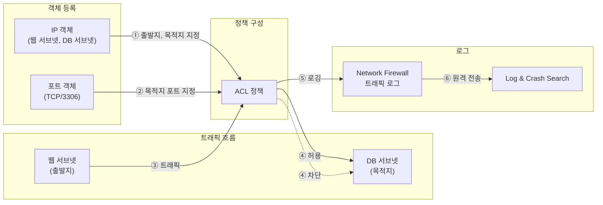

# Network Firewall 정책 구성하기

Network Firewall은 NHN Cloud에서 사용하는 인프라 자산을 안전하게 보호하기 위해 제공하는 관리형 네트워크 보안 서비스입니다. 별도의 방화벽 제품 없이도 내·외부 통신 경로에 위치한 방화벽을 간편하게 운영할 수 있으며, VPC 간 트래픽과 인바운드·아웃바운드 트래픽을 통합적으로 제어하고 실시간 로그를 기록할 수 있습니다.

**정책**은 Network Firewall에서 트래픽을 제어하는 단위입니다. 출발지, 목적지, 목적지 포트, 동작(허용 또는 차단)으로 구성된 ACL로, 조건에 맞는 트래픽을 허용하거나 차단하는 규칙입니다. 여기에서는 Network Firewall 정책에서 사용할 객체를 등록하고, 허용 및 차단 정책을 추가한 뒤, 트래픽 로그를 Log & Crash Search로 전송하는 시나리오를 살펴봅니다.



> **다이어그램 청사진**
> 위 Mermaid 코드는 작성자가 사내 디자인 규격에 맞게 그릴 때 참고할 청사진입니다. 게시 시에는 이 코드 블록과 안내 어드모니션을 삭제하고 작성자가 그린 이미지로 교체합니다.

> **💡 알아두기: Security Groups와의 역할 분담**
> Network Firewall과 Security Groups는 모두 트래픽을 제어하지만, 적용 범위와 방식이 다릅니다. 두 서비스는 독립적으로 동작하므로, 양쪽 모두에서 허용해야 트래픽이 통과합니다.
>
> | 구분 | Security Groups | Network Firewall |
> |---|---|---|
> | 적용 단위 | 인스턴스 | VPC(서브넷) |
> | 기본 정책 | 모든 아웃바운드 허용, 모든 인바운드 차단 | 모든 트래픽 차단(default-deny) |
> | 로그 | 미지원 | 정책별 로깅 가능 |
> | 우선순위 | 없음(규칙 합집합 적용) | 우선순위 번호로 순서 지정 |

## 시작하기 전에

- Network Firewall 서비스가 활성화되어 있고, Network Firewall 생성이 완료되어 있어야 합니다. 생성 시 VPC, 서브넷, NAT용 서브넷, 외부 전송용 서브넷을 지정해야 하므로, 보호 대상 VPC와 용도별 서브넷(보호 대상 서브넷, NAT용 서브넷, 외부 전송용 서브넷)을 미리 구성하세요. 서비스 활성화 및 Network Firewall 생성에 대한 자세한 내용은 [콘솔 사용 가이드](https://docs.nhncloud.com/ko/Security/Network-Firewall/ko/console-guide/)를 참고하세요.
- 트래픽 로그를 외부로 전송하려면 Log & Crash Search 서비스가 활성화되어 있어야 합니다.

> **💡 알아두기**
> Network Firewall은 생성 시점부터 과금이 시작됩니다. 이중화(HA) 구성이 아닌 단일 구성을 선택하면 1대만 과금됩니다.

## 허용 정책 추가하기

Network Firewall은 기본 정책이 **모든 트래픽 차단**(default-deny)입니다. 따라서 필요한 트래픽만 명시적으로 허용하는 방식으로 정책을 구성합니다.

다음 예시는 웹 서브넷(192.168.0.0/24)에서 DB 서브넷(192.168.10.0/24)으로의 MySQL(TCP/3306) 접근을 허용하는 정책을 추가합니다.

### 1단계. IP 객체 등록

정책에서 사용할 출발지, 목적지를 IP 객체로 먼저 등록합니다. 객체를 만들어 두면 여러 정책에서 재사용할 수 있고, IP 대역이 변경되더라도 객체만 수정하면 됩니다.

1. NHN Cloud 콘솔에서 **Security > Network Firewall**을 클릭하세요.

2. **객체** > **IP** 탭을 선택하세요.

3. **추가**를 클릭하세요. 다음 정보를 입력합니다.

    | 항목 | 입력 값 | 설명 |
    |---|---|---|
    | 이름 | `web-subnet` | 식별 가능한 이름을 입력합니다. |
    | 타입 | 서브넷 | 서브넷, 범위, 그룹 중 선택합니다. |
    | IP 주소 | `192.168.0.0/24` | CIDR 형식으로 입력합니다. CIDR에 대한 자세한 내용은 하단의 [용어 정리](#용어-정리)를 참고하세요. |

4. 같은 방식으로 DB 서브넷 객체도 등록합니다.

    | 항목 | 입력 값 |
    |---|---|
    | 이름 | `db-subnet` |
    | 타입 | 서브넷 |
    | IP 주소 | `192.168.10.0/24` |

### 2단계. 포트 객체 등록

1. **객체** > **포트** 탭을 선택하세요.

2. **추가**를 클릭하세요. 다음 정보를 입력합니다.

    | 항목 | 입력 값 | 설명 |
    |---|---|---|
    | 이름 | `mysql-port` | 식별 가능한 이름을 입력합니다. |
    | 프로토콜 | TCP | TCP, UDP, ICMP 중 선택합니다. |
    | 포트 번호 | `3306` | MySQL의 기본 포트입니다. |

### 3단계. 정책 추가

1. **정책** > **ACL** 탭으로 이동하세요.

2. **추가**를 클릭하면 **정책 추가** 대화 상자가 나타납니다.

3. 다음 정보를 입력합니다.

    | 항목 | 입력 값 | 설명 |
    |---|---|---|
    | 이름 | `allow-web-to-db-mysql` | 정책 의도를 알 수 있는 이름을 권장합니다. |
    | 설명 | 웹 서브넷에서 DB 서브넷으로의 MySQL 접근 허용 | 선택 사항입니다. |
    | 상태 | 활성화 | 비활성화하면 정책이 적용되지 않습니다. |
    | 동작 | 허용 | 허용 또는 차단을 선택합니다. |
    | 스케줄 | 항상 | 특정 시간대에만 적용하려면 스케줄을 지정합니다. |
    | 로깅 | 사용 | 이 정책에 해당하는 트래픽의 로그를 기록합니다. |

4. **출발지** 영역에서 **추가**를 클릭하면 등록된 IP 객체 목록이 대화 상자로 나타납니다. `web-subnet` 객체를 선택한 뒤 **확인**을 클릭하세요.

5. **목적지** 영역에서 **추가**를 클릭한 뒤, `db-subnet` 객체를 선택하세요.

6. **목적지 포트** 영역에서 **추가**를 클릭한 뒤, `mysql-port` 객체를 선택하세요.

7. **적용**을 클릭하세요.

정책이 추가되면 ACL 테이블에 새 행이 나타납니다. 우선순위는 기존 정책 위에 자동 배정됩니다. `default-deny`(우선순위 0)보다 높은 우선순위를 가지므로, 조건에 맞는 트래픽은 차단되지 않고 이 정책에 의해 허용됩니다.

> **💡 알아두기**
> `default-deny`는 항상 맨 아래에 위치하며, 그 아래로는 정책을 이동할 수 없습니다. 정책 간 순서를 조정하려면 **이동**을 클릭해 우선순위를 변경할 수 있습니다.

## 로그 확인 및 Log & Crash Search 연동하기

### 콘솔에서 로그 확인하기

정책에 로깅을 활성화했다면, **로그** 탭에서 트래픽 로그를 조회할 수 있습니다.

1. **로그** 탭을 클릭한 뒤, **트래픽** 하위 탭을 선택하세요.

2. 조회 기간을 설정합니다. 기본값은 **최근 15분**입니다.

3. 필요에 따라 필터를 지정합니다.

    | 필터 | 설명 |
    |---|---|
    | 출발지 | 출발지 IP로 필터링합니다. |
    | 목적지 | 목적지 IP로 필터링합니다. |
    | 목적지 포트 | 목적지 포트 번호로 필터링합니다. |
    | 프로토콜 | ALL, TCP, UDP 등에서 선택합니다. |
    | 동작 | ALL, 허용, 차단 중 선택합니다. |

4. **검색**을 클릭하세요. 결과는 테이블 형태로 표시되며, 날짜/시간, 출발지, 목적지, 프로토콜, 포트, 동작, 정책 이름 등을 확인할 수 있습니다.

> **💡 알아두기**
> **엑셀 내려받기**를 클릭해 조회 결과를 다운로드할 수 있습니다.

### 기본 차단 정책 로그 활성화

기본 정책인 `default-deny`는 별도로 로깅을 활성화해야 로그가 기록됩니다.

1. **옵션** 탭을 클릭하세요.

2. **로그 설정** 영역에서 **기본 차단 정책 로그 설정**의 **설정 변경**을 클릭하세요.

3. **로그 설정**을 **사용**으로 변경한 뒤 **저장**을 클릭하세요.

이 설정을 활성화하면 어떤 정책에도 해당하지 않아 기본 차단된 트래픽도 로그에 기록됩니다. 차단된 트래픽의 출발지와 목적지를 파악할 수 있어 정책 누락을 발견하는 데 유용합니다.

### Log & Crash Search로 로그 전송하기

Network Firewall 콘솔의 **로그** 탭은 단기 조회에 적합합니다. 장기 보관이나 검색·알림이 필요하다면 Log & Crash Search로 로그를 전송하세요.

1. Log & Crash Search 서비스가 활성화되어 있는지 확인하세요. 활성화되어 있지 않다면 **서비스 선택** 화면에서 **Data & Analytics** 카테고리의 **Log & Crash Search**를 활성화하세요.

2. **옵션** 탭으로 이동하세요.

3. **로그 설정** 영역에서 **로그 원격 전송 설정**의 **설정 변경**을 클릭하세요. 설정 화면이 나타납니다.

4. 설정 화면 상단의 **Log & Crash Search**를 클릭하세요.

5. **원격 전송**을 **사용**으로 변경한 뒤 **저장**을 클릭하세요.

> **💡 알아두기**
> Syslog 서버나 Object Storage로도 로그를 전송할 수 있습니다. 같은 **로그 원격 전송 설정** 화면에서 **Syslog** 또는 **Object Storage**를 선택하면 됩니다. Syslog를 선택하면 원격지의 IP 주소, 프로토콜(UDP/TCP), 포트 번호를 지정합니다.

## 동작 확인하기

정책이 의도한 대로 동작하는지 다음 순서로 확인합니다.

1. 웹 서브넷에 속한 인스턴스에서 DB 서브넷의 MySQL 포트로 접속을 시도합니다.

    ```sh
    mysql -h 192.168.10.x -P 3306 -u <사용자> -p
    ```

    > `192.168.10.x`는 DB 인스턴스의 실제 IP 주소로 바꿔 입력합니다.

2. 접속이 성공하면 정책이 정상 적용된 것입니다.

3. **로그** > **트래픽** 탭에서 해당 트래픽이 허용 동작으로 기록되었는지 확인하세요.

4. 반대로, 허용 정책에 해당하지 않는 트래픽(예: SSH 접속)을 시도하면 `default-deny` 정책에 의해 차단됩니다. 기본 차단 정책 로그를 활성화했다면 차단 로그도 확인할 수 있습니다.

## 응용하기

- **정책 일괄 등록**: 등록할 정책이 많다면 **정책 일괄 등록** 기능을 사용합니다. **템플릿 내려받기**로 양식을 받아 작성한 뒤 업로드하면 여러 정책을 한 번에 추가할 수 있습니다.
- **인스턴스 객체 활용**: **객체** 탭의 **인스턴스 객체 추가**를 클릭하면, 프로젝트 내 인스턴스의 IP를 자동으로 가져와 객체로 등록할 수 있습니다. IP를 직접 입력하지 않아도 되므로 편리합니다.
- **스케줄 기반 정책**: 특정 시간대에만 정책을 적용하려면 정책 추가 시 **스케줄** 항목을 지정합니다. 예를 들어, 업무 시간에만 개발 서브넷에서 운영 DB로의 접근을 허용하는 정책을 만들 수 있습니다.

## 용어 정리

| 용어 | 설명 |
|---|---|
| Network Firewall | NHN Cloud에서 사용하는 인프라 자산을 안전하게 보호하기 위해 사용하는 네트워크 방화벽 서비스 |
| VPC | 가상 사설 클라우드. 논리적으로 분리된 가상의 네트워크 |
| 보안 그룹 | 인스턴스의 송수신 트래픽을 제어하는 기능 |
| 서브넷 | Subnetwork를 의미하여, IP 네트워크를 더 작은 단위로 세분화한 IP 주소 영역 |
| ACL | 접근 제어 목록. 네트워크의 유입/유출 트래픽을 제어하는 기능 |
| CIDR | 클래스 없는 도메인 간 라우팅 기법이자, IP 주소를 효율적으로 사용하기 위한 IP 주소 할당 방법. '사이더' 또는 'CIDR[씨아이디알]'로 읽음 |
| 방화벽 | 미리 정의된 보안 규칙에 기반하여 들어오고 나가는 네트워크 트래픽을 모니터링하고 제어하는 네트워크 보안 시스템 |
| 트래픽 | 일정 시간 동안 네트워크를 통해 송수신되는 데이터의 양 |


