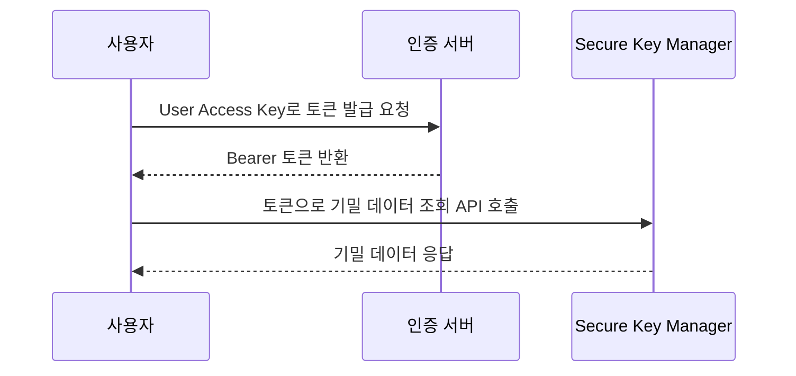

# User Access Key 토큰으로 Secure Key Manager API 호출하기

NHN Cloud는 서비스와 리소스를 외부 시스템이나 사용자 애플리케이션에서 제어하고 연동할 수 있도록 Public API를 제공합니다. Public API를 호출하려면 요청자가 정당한 사용자임을 증명하는 인증 절차가 필요하며, NHN Cloud는 API 인증 방법으로 목적에 따라 User Access Key 토큰, IaaS 토큰, User Access Key, Appkey, 프로젝트 통합 Appkey, S3 API 자격 증명을 지원합니다.

서비스마다 지원하는 인증 방식이 다르므로, 사용할 API가 어떤 인증 방식을 지원하는지 [인증 방식 지원 현황](https://docs.nhncloud.com/ko/nhncloud/ko/public-api/supported-authentication-methods)에서 먼저 확인해야 합니다.

이 가이드에서는 NHN Cloud의 키 관리 서비스 Secure Key Manager에 기밀 데이터를 등록한 뒤 Secure Key Manager API v1.3을 사용해 이를 조회하기 위해 User Access Key 토큰을 발급받고 API 인증을 수행하는 시나리오를 진행합니다. 토큰 발급과 API 인증 방법은 User Access Key 토큰을 지원하는 다른 서비스에도 동일하게 적용할 수 있습니다.



## 시작하기 전에

- 이 가이드의 시나리오를 수행하려면 Secure Key Manager 서비스가 활성화되어 있어야 합니다. 프로젝트 생성 및 서비스 활성화 방법은 [서비스 활성화 가이드](https://docs.nhncloud.com/ko/nhncloud/ko/console-guide/#_21)를 참고하세요.
- API 호출을 위해 `curl`이 설치된 터미널 환경이 필요합니다.

## 시나리오 환경 준비하기

### 키 저장소 생성하기

키 저장소는 암호화 키와 접근 제어 정보를 묶어서 관리하는 단위입니다. 기밀 데이터를 등록하려면 먼저 키 저장소를 만들어야 합니다.

1. NHN Cloud 콘솔에서 **Security > Secure Key Manager**를 클릭하세요.

2. **키 저장소** 탭에서 **+** 버튼을 클릭하세요.

3. **키 저장소 추가** 대화 상자에서 다음 항목을 입력합니다.

    | 항목 | 설명 |
    |---|---|
    | **이름** | 키 저장소를 식별할 이름을 입력합니다. 이 가이드에서는 `my-keystore`를 입력합니다. |
    | **설명** | 키 저장소의 용도를 적습니다. |
    | **인증 방법** | 키 저장소에 접근할 클라이언트의 인증 방법을 선택합니다. **IPv4 주소**, **MAC 주소**, **클라이언트 인증서** 중 하나 이상을 선택합니다. 이 가이드에서는 **IPv4 주소**를 선택합니다. |
    | **인증 방식 결합** | 인증 방법을 여러 개 선택한 경우 결합 방식을 지정합니다. 이 가이드에서는 **하나만 통과(OR)**를 선택합니다. |

4. **추가**를 클릭하세요.

### 접근 제어 설정하기

Secure Key Manager는 등록된 IP에서만 API 호출을 허용합니다. API를 호출할 환경의 공인 IPv4 주소를 등록해야 이후 단계에서 API 호출이 정상적으로 동작합니다.

1. 키 저장소 목록에서 방금 생성한 키 저장소를 클릭하세요.

2. **IPv4 주소 관리** 탭을 클릭하세요.

3. **+ IPv4 주소 추가**를 클릭하세요.

4. **IPv4 주소 추가** 대화 상자에서 API를 호출할 환경의 공인 IPv4 주소를 입력한 뒤 **추가**를 클릭하세요.

### 기밀 데이터 등록하기

API로 조회할 기밀 데이터를 키 저장소에 등록합니다.

1. **키 관리** 탭을 클릭하세요.

2. **+ 키 추가**를 클릭하세요.

3. **키 추가** 대화 상자에서 다음과 같이 입력합니다.
    - **유형**: **기밀 데이터**를 선택합니다.
    - **이름**: `my-secret`을 입력합니다.
    - **데이터**: 저장할 값을 입력합니다. 이 가이드에서는 `my-api-key-12345`를 입력합니다.

4. **추가**를 클릭하세요. 키 목록 테이블에 방금 등록한 기밀 데이터가 표시됩니다. **아이디** 열의 값을 복사해 두세요. 이후 API 호출 시 이 값을 `{keyid}`로 사용합니다.

## 토큰 발급 및 API 호출하기

### Appkey 확인하기

Secure Key Manager API를 호출하려면 서비스 Appkey가 필요합니다. Appkey는 API 요청 URL에 포함되어 프로젝트와 서비스를 식별하는 데 사용됩니다.

1. Secure Key Manager 콘솔 상단의 **URL & Appkey**를 클릭하세요.

2. 모달에서 **Appkey** 값을 복사해 두세요. 이후 API 호출 시 이 값을 `{appkey}`로 사용합니다.

### User Access Key 발급하기

User Access Key는 토큰 발급에 필요한 인증 키입니다. Secret Access Key와 함께 사용합니다.

1. NHN Cloud 콘솔 우측 상단의 계정에 마우스 포인터를 올린 뒤 **API 보안 설정**을 클릭하세요.

2. **User Access Key 생성**을 클릭하세요.

3. **User Access Key 생성** 모달에서 토큰 유형과 유효 시간을 설정합니다. 이 가이드에서는 기본값인 **Opaque** 타입과 **24시간**을 그대로 사용합니다. **생성**을 클릭하세요.

4. **Secret Access Key**를 반드시 복사해 두세요. 모달을 닫은 뒤에는 다시 확인할 수 없습니다.

> [!WARNING]
> User Access Key 또는 Secret Access Key가 유출되었거나 유출이 의심되는 경우 해당 키를 즉시 폐기하고 새로 발급받아야 합니다.

### User Access Key 토큰 발급하기

앞서 발급받은 User Access Key와 Secret Access Key로 Bearer 토큰을 발급합니다. 인증 서버에 `POST` 요청을 보내면 API 호출에 사용할 토큰이 반환됩니다.

다음 curl 명령에서 `{UserAccessKeyID}`와 `{SecretAccessKey}`를 실제 값으로 교체한 뒤 실행하세요.

```sh
curl -X POST "https://oauth.api.nhncloudservice.com/oauth2/token/create" \
  -H "Content-Type: application/x-www-form-urlencoded" \
  -u "{UserAccessKeyID}:{SecretAccessKey}" \
  -d "grant_type=client_credentials"
```

요청이 성공하면 다음과 같은 응답이 반환됩니다.

```json
{
    "access_token": "luzocEoQ3tyMvM6pLtoSTHSphgJSGhl5hVvgSstdVQ1X1bZnf9AEMGAcSERIi1Dq0bybSMv0raOcahZjYpZ2biaaoF3jTi9caF5M2TN9F98iZawbBJmN94CPF2Rpe0JI",
    "token_type": "Bearer",
    "expires_in": 86400
}
```

`access_token` 값을 복사해 두세요. 다음 단계에서 API 호출 시 인증 헤더에 사용합니다.

> [!NOTE]
> 토큰의 유효 시간은 기본 86,400초(24시간)이며, **API 보안 설정** 페이지에서 60초~86,400초 범위 내에서 변경할 수 있습니다.

### 기밀 데이터 조회 API 호출하기

발급받은 토큰을 `X-NHN-Authorization` 헤더에 담아 Secure Key Manager API를 호출합니다. `{appkey}`, `{keyid}`, `{access_token}`을 앞서 복사한 실제 값으로 교체하세요.

```sh
curl -X GET "https://api-keymanager.nhncloudservice.com/keymanager/v1.3/appkey/{appkey}/secrets/{keyid}" \
  -H "X-NHN-Authorization: Bearer {access_token}"
```

요청이 성공하면 다음과 같은 응답이 반환됩니다.

```json
{
    "header": {
        "resultCode": 0,
        "resultMessage": "success",
        "isSuccessful": true
    },
    "body": {
        "secret": "my-api-key-12345"
    }
}
```

`body.secret`에 앞서 등록한 기밀 데이터가 포함되어 있으면 정상적으로 조회된 것입니다.

> [!NOTE]
> Secure Key Manager API의 전체 파라미터 명세는 [Secure Key Manager API v1.3 가이드](https://docs.nhncloud.com/ko/Security/Secure%20Key%20Manager/ko/api-guide-v1.3/)를 참고하세요. User Access Key 토큰 인증은 API v1.3에서만 지원합니다.

## 용어 정리

| 용어 | 설명 |
|---|---|
| 인증 | 시스템에 접근한 사용자가 등록된 사용자인지를 확인하는 절차 |

---

## 🔍 작성자 검증 체크리스트

게시 전 다음 항목을 실제 NHN Cloud 콘솔/API와 대조해 확인하세요. **이 섹션은 게시 시 삭제합니다.**

- [x] 콘솔 메뉴 경로: `Security > Secure Key Manager` ← Playwriter 확인 완료
- [x] 키 저장소 추가 버튼: `+` 버튼 ← 검증된 가이드 확인 완료
- [x] 키 저장소 추가 대화 상자 필드: 이름, 설명, 인증 방법(IPv4 주소/MAC 주소/클라이언트 인증서), 인증 방식 결합(모두 통과(AND)/하나만 통과(OR)) ← Playwriter 확인 완료
- [x] IPv4 주소 관리 탭 및 IPv4 주소 추가 대화 상자 ← 검증된 가이드 확인 완료
- [x] 키 추가 버튼: `+ 키 추가` ← 검증된 가이드 확인 완료
- [x] 키 추가 대화 상자 유형 라디오: `기밀 데이터`, `대칭 키`, `비대칭 키` ← Playwriter 확인 완료
- [x] 키 추가 대화 상자 입력 필드: 이름(필수), 설명, 데이터(필수) ← Playwriter 확인 완료
- [x] URL & Appkey 버튼 및 모달 구성 ← Playwriter 확인 완료
- [x] API 보안 설정 메뉴 경로: 계정 드롭다운 > `API 보안 설정` ← Playwriter 확인 완료
- [x] User Access Key 생성 버튼 ← Playwriter 확인 완료
- [x] SKM API 도메인: `https://api-keymanager.nhncloudservice.com` ← Playwriter 확인 완료 (URL & Appkey 모달)
- [x] 토큰 발급 API 엔드포인트: `POST https://oauth.api.nhncloudservice.com/oauth2/token/create` ← 공식 문서 확인 완료
- [x] 기밀 데이터 조회 API 경로: `GET /keymanager/v1.3/appkey/{appkey}/secrets/{keyid}` ← 공식 문서 확인 완료
- [x] 인증 헤더 형식: `X-NHN-Authorization: Bearer {access_token}` ← 공식 문서 확인 완료
- [x] User Access Key 생성 모달 구성: 토큰 형식(Opaque/JWT), 토큰 유효 시간 스핀버튼 ← Playwriter 확인 완료
- [x] Secret Access Key 발급 완료 모달: Secret Access Key 텍스트 표시, 복사 버튼, 확인 버튼 ← Playwriter 확인 완료
- [x] 토큰 발급 API 실제 호출 테스트: 정상 응답(access_token, token_type, expires_in) 확인 ← curl 실행 완료
- [x] 기밀 데이터 조회 API 실제 호출 테스트: 신규 키 저장소(my-keystore) 생성 → IPv4 등록 → 기밀 데이터 등록 → 토큰 발급 → API 호출 성공. 응답 `body.secret: "my-api-key-12345"` 확인 ← curl 실행 완료
- [ ] 인증 토큰 다이어그램 작성 후 Mermaid 코드 블록과 청사진 안내 어드모니션 삭제
- [ ] 작성한 다이어그램 이미지가 사내 디자인 규격을 따르는지 확인
